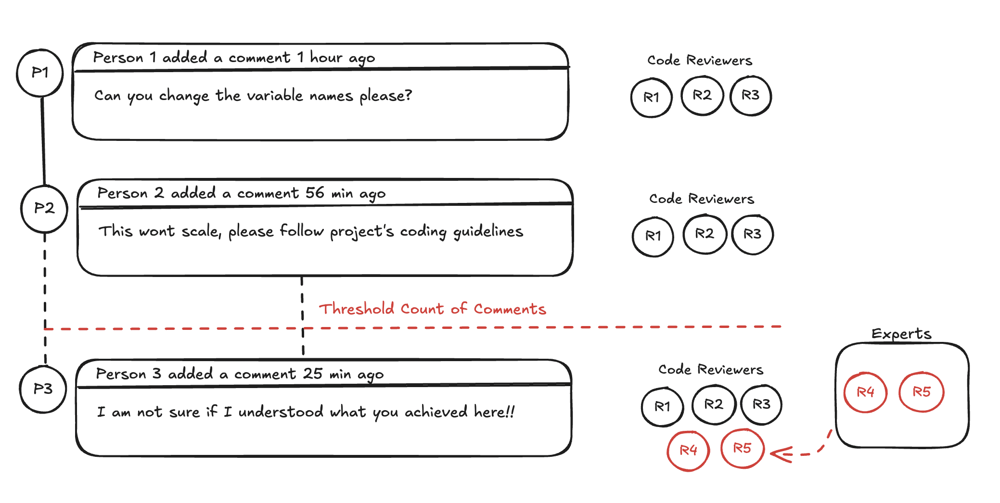

# PR Comment Management Workflow

This GitHub workflow automates the management of pull requests by adding reviewers and sending Slack notifications based on the number of comments on the pull request.

## Setup

1. Create a GitHub repository and add the workflow to it.
2. Create a Slack webhook URL and store it in the `SLACK_WEBHOOK` secret.
3. Update the `COMMENT_THRESHOLD` with the desired threshold for requesting additional reviewers, the default value is `5`.
4. Update the slack handle and github handle of reviewers in the `reviewers` object. (may add this to a config file later)

## Usage

1. The workflow will be triggered when an issue comment or pull request review comment is created, however, it will only process pull requests.
2. The workflow will automatically add reviewers and send Slack notifications based on the number of comments on the pull request.

## Flow

The workflow is shown below:

## Todo

- [ ] Add config file for reviewers
- [ ] Add config file for slack webhook
- [ ] Should add a check to not include existing comments by the workflow itself in the comment count (__WARNING: this might trigger a never exiting loop!!__)
- [ ] Add an AI agent flow using Model Context Protocol to fetch real time reviewer suggestions based on an org wide skill database and similar criteria

## License

[MIT License](LICENSE)

Copyright (c) 2025 Harmeet Singh    

